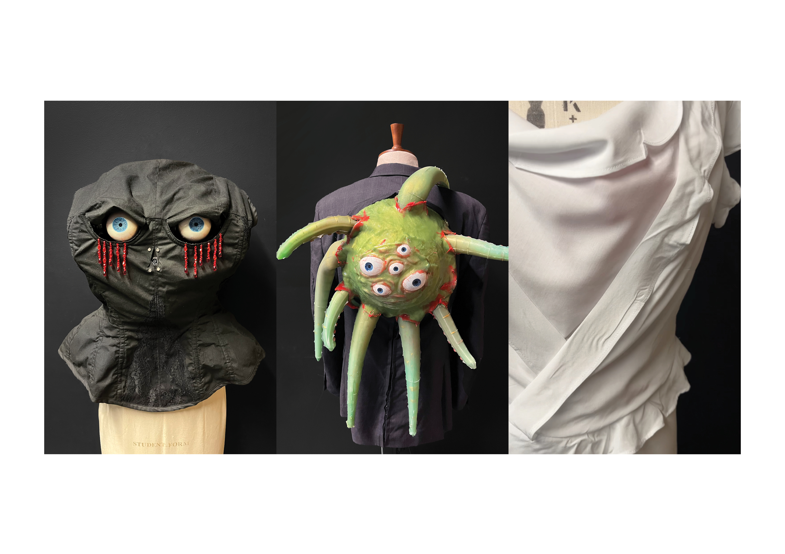

# The Case for Misandry: A Networked Wearable Robotic Ecosystem



A networked system of three interconnected robotic garments that communicate in real time. Built as my MA Fashion Futures final project at London College of Fashion, UAL, and my first ever technical project.

Each garment operates as a node in a distributed system: a Raspberry Pi running a computer vision pipeline detects and tracks faces, triggering pneumatic soft robotic actuators across all three garments via ESP32 microcontrollers over a local Wi-Fi network. The result is a responsive, living ecosystem that reacts to the presence of a viewer.

---

## System Architecture

```
                  +----------------------------------+
                  |        Raspberry Pi              |
                  |   (Computer Vision / Master)     |
                  +----------------+-----------------+
                                   |
                  +----------------+----------------+
                  |        Local Wi-Fi Network        |
                  +--------+----------------+-------+
                           |                |
        HTTP GET /trigger  |                |  HTTP GET /trigger
        (192.168.1.103)    |                |  (192.168.1.200)
                           v                v
              +------------+----+      +----+------------+
              | Garment 2 ESP32 |      | Garment 3 ESP32 |
              |  The Tentacles  |      |    The Worms    |
              +------------+----+      +------------+----+
                           |                |
        Hardware Serial    |                |  Hardware Serial
             115200 baud   v                v  9600 baud
              +------------+----+      +----+------------+
              |  Arduino Mega   |      |  Arduino Mega   |
              | (Motor Control) |      |(Pneumatic Loop) |
              +-----------------+      +-----------------+
```

---

## The Garments

**Garment 1: The Eyes**
A Raspberry Pi runs a Python/OpenCV computer vision pipeline, tracking faces in real time and dispatching HTTP signals to the other garments. A second Pi drives a kiosk display showing a live web gallery built with Flask. On boot, the Pi emails its IP address automatically for remote access.

**Garment 2: The Tentacles**
An ESP32 receives the trigger signal and forwards it over hardware serial to an Arduino Mega, which drives motors and pneumatic pumps via a motorised pulley system and 3D-printed structures.

**Garment 3: The Worms**
An ESP32 hosts its own Wi-Fi access point and a simple web interface for manual start/stop control. It relays signals to an Arduino Mega running an 18-step non-blocking pneumatic state machine controlling six pumps and twelve valves.

---

## Tech Stack

**Hardware**
- Raspberry Pi (x2), Arduino Mega (x2), ESP32 (x2)
- Pneumatic soft robotic actuators (silicone-cast)
- Servo motors, peristaltic pumps, solenoid valves
- Custom PCBs (Garments 2 and 3)
- FDM 3D-printed structural components

**Software**
- Python, OpenCV, NumPy (computer vision pipeline)
- C++ via Arduino IDE (motor and pneumatic control)
- Flask, SQLite (web gallery and logging)
- HTML, CSS, JavaScript (gallery front end)
- I2C and Serial inter-chip communication

---

## Repository Structure

```
wearable-robotics-system/
├── garment-1-eyes/
│   ├── eyes-pi/               # Computer vision pipeline, web gallery, IP mailer
│   │   ├── eyes_control.py    # OpenCV face tracking and ESP32 signal dispatch
│   │   ├── web_gallery.py     # Flask web gallery and SQLite logging
│   │   └── send_ip.py         # Boot IP notification via email
│   ├── kiosk-pi/              # Second Pi running the kiosk display
│   │   ├── kiosk_start.sh     # Launches Chromium kiosk browser
│   │   └── kiosk_watchdog.sh  # Monitors connection and restarts if needed
│   └── hardware/              # Fusion 360 STL files (x14)
├── garment-2-tentacles/
│   ├── esp32-comms-G2/        # Receives HTTP trigger, relays over serial to Mega
│   │   └── esp32-comms-G2.ino
│   ├── mega-tentacle-control/ # Motor and pump control
│   │   └── mega-tentacle-control.ino
│   └── hardware/              # PCB designs, schematics
├── garment-3-worms/
│   ├── esp32-comms-G3/        # Wi-Fi AP, web interface, serial bridge
│   │   └── esp32-comms-G3.ino
│   ├── mega-worms-control/    # 18-step pneumatic state machine
│   │   └── mega-worms-control.ino
│   └── hardware/              # PCB designs, schematics
└── docs/
    └── photos/
```

---

## Hardware Communication

| Link | Device A | Device B | Pin | Baud Rate |
|---|---|---|---|---|
| Garment 2 | ESP32 TX2 (Pin 17) | Arduino Mega RX1 | Hardware Serial | 115200 |
| Garment 3 | ESP32 TX0 | Arduino Mega RX1 | Hardware Serial | 9600 |

---

## Setup

Before deploying, replace the following placeholders in the relevant files:

```python
# Raspberry Pi
ESP32_TENTACLE_IP = "192.168.1.YOUR_G2_IP"
ESP32_WORM_IP     = "192.168.1.YOUR_G3_IP"
```

```cpp
// ESP32 static IP config
IPAddress local_IP(192, 168, 1, YOUR_STATIC_IP);
IPAddress gateway(192, 168, 1, 1);
IPAddress subnet(255, 255, 255, 0);
```

Credentials to replace before pushing publicly:

- Wi-Fi SSID and password
- Gmail address and app password
- IFTTT webhook key (if used)
- File paths containing your username

**Raspberry Pi dependencies:**

```bash
sudo apt update && sudo apt install python3-pip chromium-browser -y
pip3 install -r requirements.txt
chmod +x garment-1-eyes/kiosk-pi/kiosk_start.sh
chmod +x garment-1-eyes/kiosk-pi/kiosk_watchdog.sh
```

**Arduino:** flash the relevant `.ino` files via Arduino IDE, selecting the correct board (ESP32 Dev Module or Arduino Mega 2560) and port for each.

---

## Credits

The eye mechanism 3D models in `garment-1-eyes/hardware/` are adapted from [EyeMech 1.0](https://willcogley.notion.site/EyeMech-1-0-983e6cad7059410d9cb958e8c1c5b700) by Will Cogley, licensed under [CC BY-NC-SA 4.0](http://creativecommons.org/licenses/by-nc-sa/4.0/). Modifications were made to fit the garment's structural requirements.
